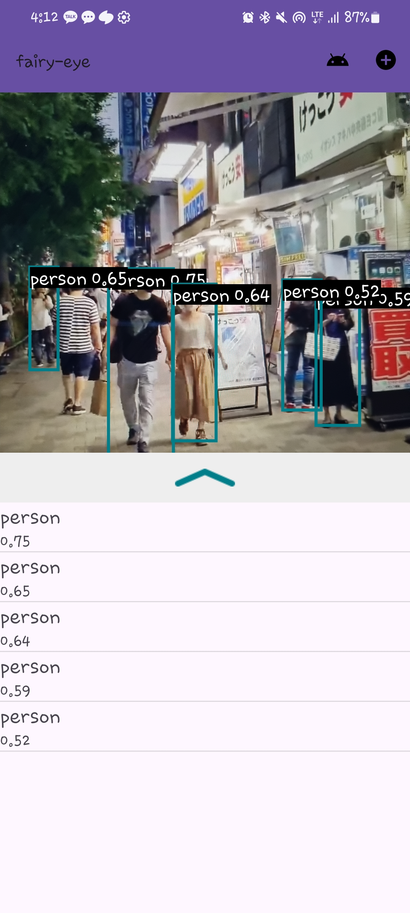

# Fairy-eye

> 사회적 약자를 위한 생활 보조 인공지능

|                        |                        |                        |
|:----------------------:|:----------------------:|:----------------------:|
|  |  |  |

## 1. 프로젝트 소개

## 2. 프로젝트 목표

## 3. 프로젝트 구성

## 4. 프로젝트 결과

## 5. 프로젝트 활용

## 6. 프로젝트 향후 계획

Google Gemini를 S24에 적용하여, On-Device 형식으로 구현해보는것이 목표

## 7. 프로젝트 참여자

<table>
   <tr>
      <td align="center">
         
      </td>
      <td align="center">
             
      </td>
      <td align="center">
             
      </td>
   <tr>
      <td align="center">
         
         <b>
         김남주
         </b>
         
      </td>
      <td align="center">
         
         <b>
         윤채민
         </b>
         
      </td>
      <td align="center">
         
         <b>
         윤성민
         </b>
         
      </td>
   </tr>
</table>

## 8. 프로젝트 라이센스

MIT License
